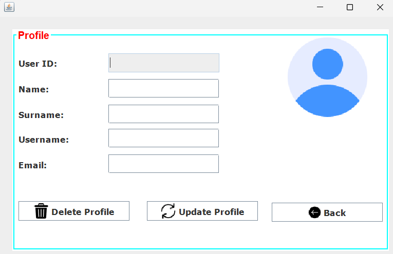
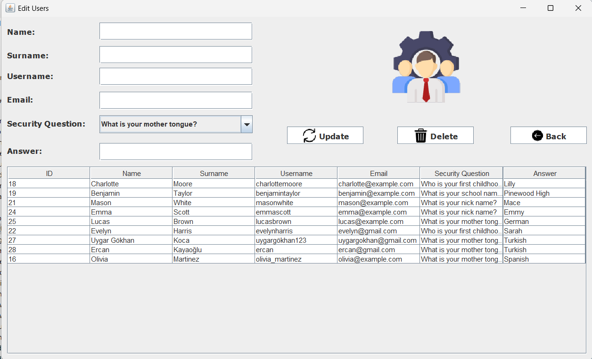

# 📚 LibraryAutomation
A comprehensive **Library Management System** built with **Java** and **PostgreSQL**, designed to streamline the management of books, users, and real-time data integrations.

---

## 🚀 Features
| Feature                   | Description                                                                 |
|---------------------------|-----------------------------------------------------------------------------|
| 🔒 **User Management**        | Secure user authentication and profile management.                         |
| 📚 **Book Management**        | Issue, return, and track books efficiently.                                |
| 🌦️ **Weather Integration**   | Real-time weather updates using the [OpenWeatherMap API](https://openweathermap.org/). |
| 💱 **Currency Exchange Rates**| Get live exchange rates via [ExchangeRate API](https://www.exchangerate-api.com/).   |

---

## 🛠️ How to Run
1. **Clone the repository**:
   ```bash
   git clone https://github.com/yusufkayaoglu/LibraryAutomation.git
   ```
2. **Import into IDE**:
   Import the project into **Eclipse** or any Java IDE.

3. **Install Dependencies**:
   - `postgresql-<version>.jar`
   - Other external libraries.

4. **Set up Database**:
   - Use the provided `library.sql` file to create the schema and populate initial data.

5. **Run the Application**:
   Execute the `main` class in your IDE.

---

## 🗄️ Database
The application uses **PostgreSQL** for database management. The database schema and initial data are provided in the file:
- `library.sql`

### Tables Included:
- **Users**: Manages user information and credentials.
- **Books**: Stores book details such as title, author, and availability.
- **Transactions**: Tracks book issue and return logs.

---

## 🌐 APIs Used
- 🌦️ **Weather API**: [OpenWeatherMap API](https://openweathermap.org/)
- 💱 **Exchange Rate API**: [ExchangeRate API](https://www.exchangerate-api.com/)

---

## 📸 Screenshots
### Login


### Forgot Password


### Signup


### Home 


### Add New Student 


### Add New Book 


### Issue Book


### Return Book 


### Manage Records


### Edit Your Profile


### Edit Users


---

## 🤝 Contributing
Contributions are welcome! Here's how you can get started:
1. Fork the repository.
2. Create a new branch for your feature or bug fix:
   ```bash
   git checkout -b feature/new-feature
   ```
3. Commit your changes:
   ```bash
   git commit -m "Add some feature"
   ```
4. Push to the branch:
   ```bash
   git push origin feature/new-feature
   ```
5. Open a pull request.

---

## 📝 License
This project is licensed under the [MIT License](https://opensource.org/licenses/MIT).

You are free to use, modify, and distribute this software in your own projects. Please refer to the license file for more details.

---

### 🔗 Links
- 🌐 [GitHub Repository](https://github.com/yusufkayaoglu/LibraryAutomation)  
  _Explore the source code and project details._
- 📄 [Project Documentation](https://github.com/yusufkayaoglu/LibraryAutomation/blob/main/README.md)  
  _Read detailed documentation about the project._
``` 
