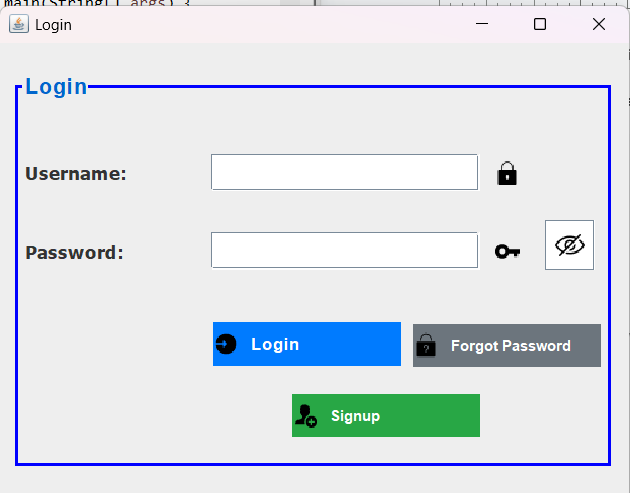
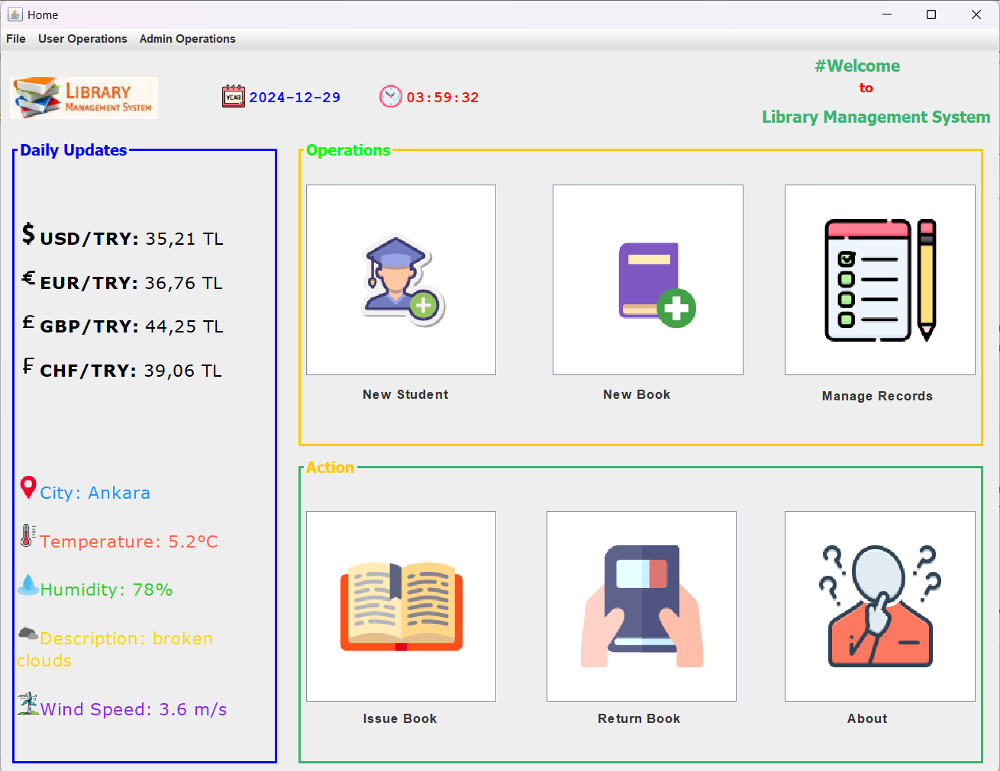
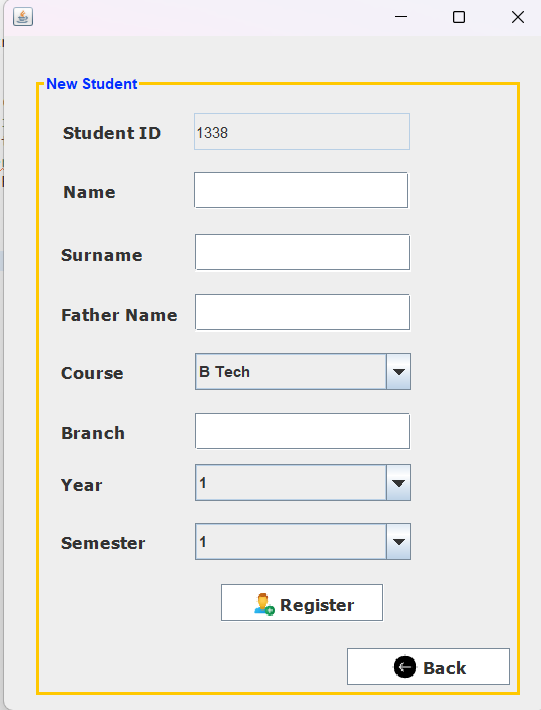
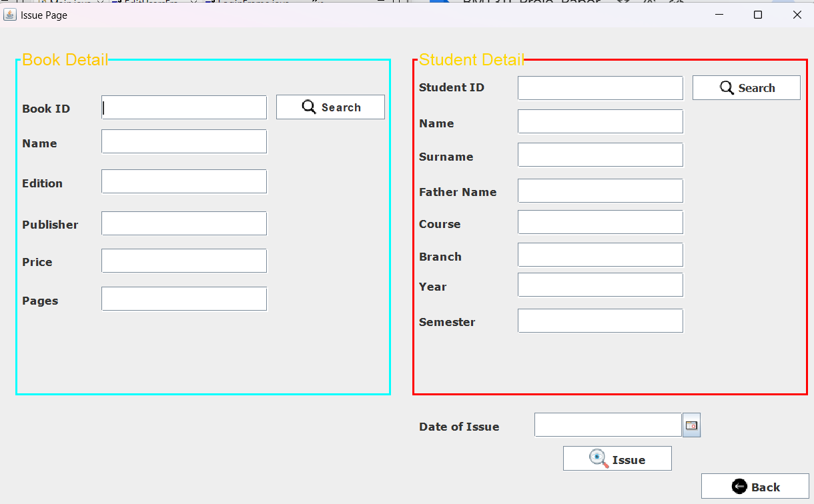
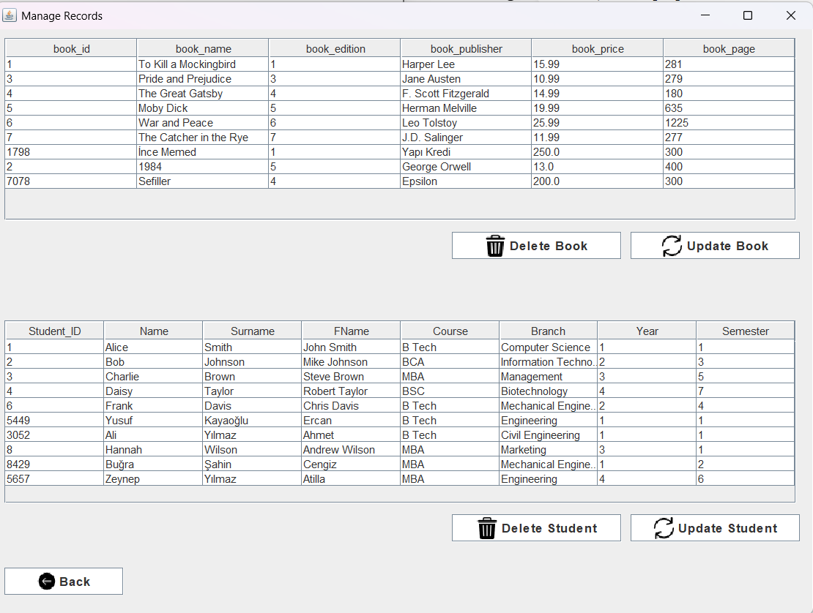
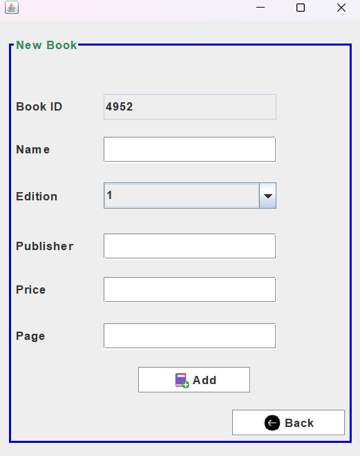
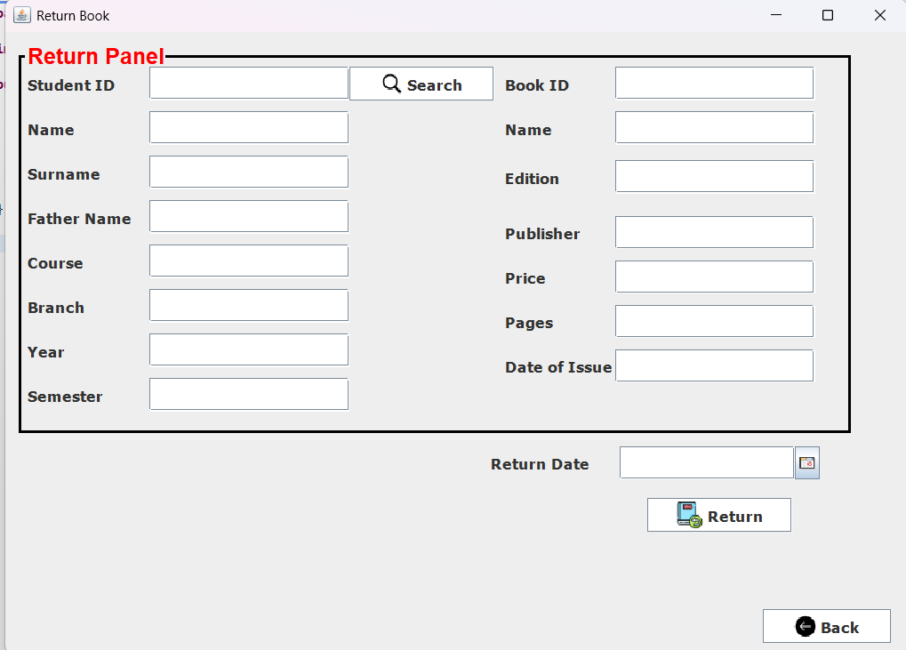
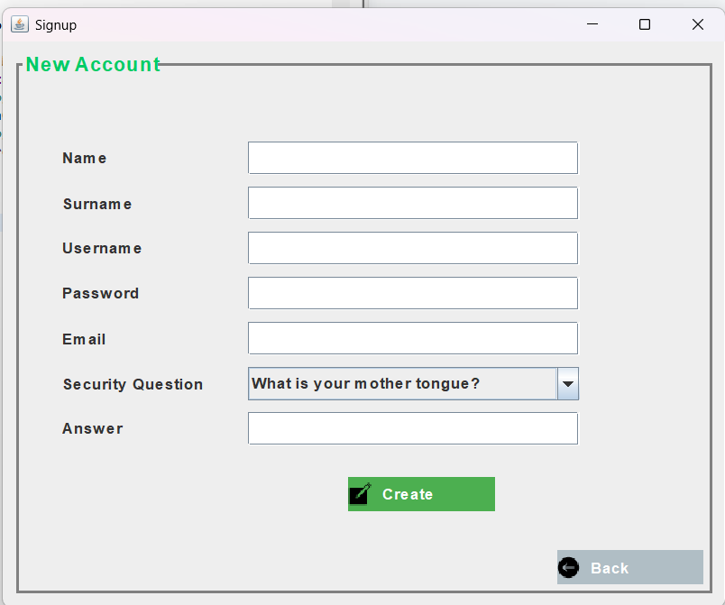
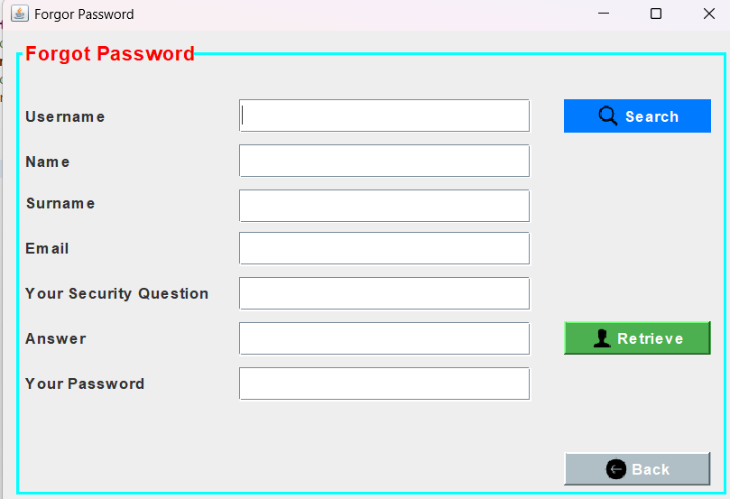

# 📚 LibraryAutomation
A comprehensive **Library Management System** built with **Java** and **PostgreSQL**, designed to streamline the management of books, users, and real-time data integrations.

---

## 🚀 Features
- 🔒 **User Management**: Secure user authentication and profile management.
- 📚 **Book Management**: Issue, return, and track books efficiently.
- 🌦️ **Weather Integration**: Real-time weather updates using the [OpenWeatherMap API](https://openweathermap.org/).
- 💱 **Currency Exchange Rates**: Get live exchange rates via [ExchangeRate API](https://www.exchangerate-api.com/).

---

## 🛠️ How to Run
1. Clone the repository:
   ```bash
   git clone https://github.com/yusufkayaoglu/LibraryAutomation.git
   ```
2. Import the project into **Eclipse** or any Java IDE.
3. Install the required dependencies:
   - `postgresql-<version>.jar`
   - Other external libraries as needed.
4. Set up the PostgreSQL database:
   - Use the provided `library.sql` file to create the schema and populate initial data.
5. Run the application from the main class.

---

## 🗄️ Database
The application uses **PostgreSQL** for database management. The database schema and initial data are provided in the file:
- `library.sql`

### Tables Included:
- **Users**: Manages user information and credentials.
- **Books**: Stores book details such as title, author, and availability.
- **Transactions**: Tracks book issue and return logs.

---

## 🌐 APIs Used
- 🌦️ **Weather API**: [OpenWeatherMap API](https://openweathermap.org/)
- 💱 **Exchange Rate API**: [ExchangeRate API](https://www.exchangerate-api.com/)

---

## 📸 Screenshots
### Login


### Home 


### Add New Student 


### Issue Book


### Manage Records Page


### Add New Book 


### Return Book 


### Signup


### Forgot Password



---

## 🤝 Contributing
Contributions are welcome! Feel free to fork the repository and submit pull requests.

---

## 📝 License
This project is licensed under the [MIT License](https://opensource.org/licenses/MIT).

---

### 🔗 Links
- [GitHub Repository](https://github.com/yusufkayaoglu/LibraryAutomation)
- [Documentation](#) *(Add link to documentation if available)*
```


